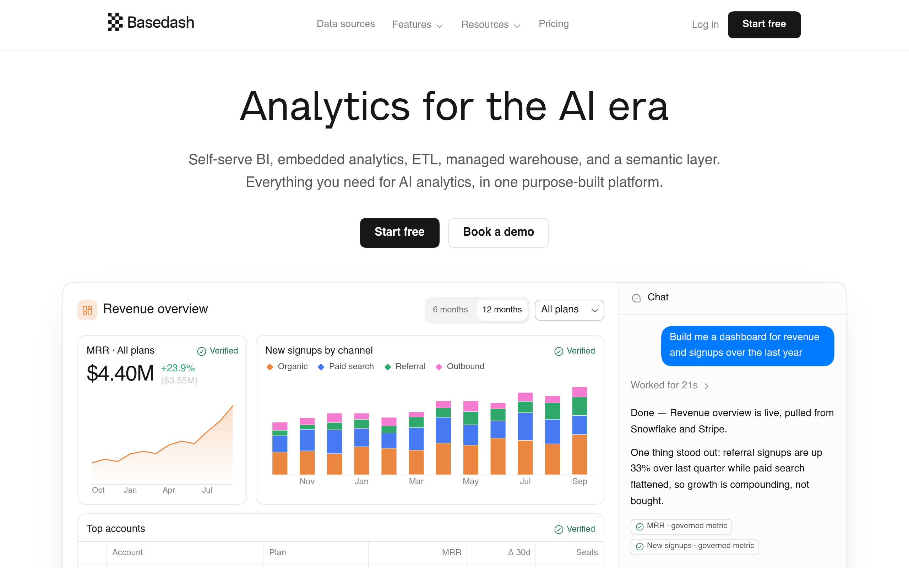

# basedash DESIGN.md

> Auto-generated design system — reverse-engineered via static analysis by skillui.
> Frameworks: None detected
> Colors: 20 · Fonts: 3 · Components: 8
> Icon library: not detected · State: not detected
> Primary theme: light · Dark mode toggle: no · Motion: expressive

## Visual Reference

**Match this design exactly** — study colors, fonts, spacing, and component shapes before writing any UI code.



---

## 1. Visual Theme & Atmosphere

This is a **light-themed** interface with a cool, approachable feel. The light background emphasizes content clarity. Typography pairs **Basedash Glitch** for display/headings with **Iowan Old Style** for body text, creating clear visual hierarchy through type contrast. Spacing follows a **4px base grid** (compact density), with scale: 2, 4, 6, 8, 10, 12, 14, 16px. The accent color **#00c758** anchors interactive elements (buttons, links, focus rings). Motion is expressive — spring physics, layout animations, and staggered reveals are part of the visual language.

---

## 2. Color Palette & Roles

| Token | Hex | Role | Use |
|---|---|---|---|
| theme-color | `#ffffff` | background | Page background, darkest surface |
| hero-chat-surface | `#131316` | surface | Card and panel backgrounds |
| hero-table-surface | `#08080a` | surface | Card and panel backgrounds |
| tile-color | `#000000` | text-primary | Headings and body text |
| accent | `#00c758` | accent | CTAs, links, focus rings, active states |
| danger | `#e8792f` | danger | Error states, destructive actions |
| color-chart-member-7 | `#2fa86b` | success | Success states, positive indicators |
| warning | `#f59e0b` | warning | Warning states, caution indicators |
| info | `#4679f2` | info | Informational highlights |
| unknown | `#4ebcfc` | unknown | Palette color |
| color-chart-member-5 | `#f84747` | unknown | Palette color |
| color-chart-member-3 | `#ea863f` | unknown | Palette color |
| unknown | `#e8e8e8` | unknown | Palette color |
| color-theme-1 | `#d67a3b` | unknown | Palette color |
| unknown | `#a369ea` | unknown | Palette color |
| color-success | `#23764b` | unknown | Palette color |
| unknown | `#fb2c36` | unknown | Palette color |
| unknown | `#22c55e` | unknown | Palette color |
| color-theme-1 | `#f49556` | unknown | Palette color |
| color-success | `#65c995` | unknown | Palette color |

### CSS Variable Tokens

```css
--tw-border-style: solid;
--color-background-1: #0c0b0a;
--color-background-2: #171513;
--tw-border-style: dashed;
--color-background-1: #080706;
--mock-muted-bar-start: #fffcf847;
--mock-muted-bar-end: #fffcf81f;
--mock-muted-bar-end-strong: #fffcf824;
--color-background-1: #fff;
--color-background-2: #fafafa;
--mock-muted-bar-start: #1717173d;
--mock-muted-bar-end: #1717171a;
--mock-muted-bar-end-strong: #17171724;
--tw-border-style: solid;
--color-background-1: #0c0b0a;
--color-background-2: #171513;
--tw-border-style: dashed;
--color-background-1: #080706;
--mock-muted-bar-start: #fffcf847;
--mock-muted-bar-end: #fffcf81f;
```


---

## 3. Typography Rules

**Font Stack:**
- **Iowan Old Style** — Heading 1, Heading 2, Heading 3
- **Basedash Glitch** — Body, Caption
- **SFMono-Regular** — Code

**Font Sources:**

```css
@font-face {
  font-family: "Basedash Glitch";
  src: url("fonts/BasedashGlitch-500.woff2") format("woff2");
  font-weight: 500;
}
```

| Role | Font | Size | Weight |
|---|---|---|---|
| Heading 1 | Iowan Old Style | 3.625rem | 700 |
| Heading 2 | Iowan Old Style | 3.25rem | 700 |
| Heading 3 | Iowan Old Style | 2.75rem | 700 |
| Body | Basedash Glitch | .75rem | 400 |
| Caption | Basedash Glitch | 20px | 400 |
| Code | SFMono-Regular | 14px | 400 |

**Typographic Rules:**
- Limit to 3 font families max per screen
- Use **Iowan Old Style** for body/UI text, **Basedash Glitch** for display/headings
- Maintain consistent hierarchy: no more than 3-4 font sizes per screen
- Headings use bold (600-700), body uses regular (400)
- Line height: 1.5 for body text, 1.2 for headings
- Use color and opacity for secondary hierarchy, not additional font sizes


---

## 4. Component Stylings

### Layout (1)

**Footer** — `html`

### Navigation (1)

**Navigation** — `html`

### Data Display (1)

**List** — `html`

### Data Input (2)

**Button** — `html`
- Animation: 

**Input** — `html`
- State: :focus, :placeholder

### Media (3)

**Image** — `html`

**Icon** — `html`

**Map/Canvas** — `html`


---

## 5. Layout Principles

- **Base spacing unit:** 4px
- **Spacing scale:** 2, 4, 6, 8, 10, 12, 14, 16, 18, 20, 24, 32
- **Border radius:** 1rem, 1.4rem, 1.75rem, 2px, 3px, 4px, 5px, 6px, 7.5px, 10px, 12px, 14px, 15px, 20px
- **Max content width:** 96rem

**Spacing as Meaning:**
| Spacing | Use |
|---|---|
| 4-8px | Tight: related items within a group |
| 12-16px | Medium: between groups |
| 24-32px | Wide: between sections |
| 48px+ | Vast: major section breaks |


---

## 6. Depth & Elevation

### Flat — subtle depth hints

- `0 1px 2px #11111114`

### Floating — dropdowns, popovers, modals

- `rgba(0, 0, 0, 0) 0px 0px 0px 0px, rgba(0, 0, 0, 0) 0px 0px 0px 0px, rgba(0, 0, 0, 0) 0px 0px 0px 0px, rgba(0, 0, 0, 0) 0px 0px 0px 0px, rgba(0, 0, 0, 0.1) 0px 10px 15px -3px, rgba(0, 0, 0, 0.1) 0px 4px 6px -4px`

### Overlay — full-screen overlays, top-level dialogs

- `rgba(0, 0, 0, 0) 0px 0px 0px 0px, rgba(0, 0, 0, 0) 0px 0px 0px 0px, rgba(0, 0, 0, 0) 0px 0px 0px 0px, rgba(0, 0, 0, 0) 0px 0px 0px 0px, rgba(0, 0, 0, 0.1) 0px 20px 25px -5px, rgba(0, 0, 0, 0.1) 0px 8px 10px -6px`

### Z-Index Scale

`0, 1, 2, 10, 20, 30, 40, 50`


---

## 7. Animation & Motion

This project uses **expressive motion**. Animations are an integral part of the experience.

### CSS Animations

- `@keyframes hero-chat-dot`
- `@keyframes spin`
- `@keyframes pulse`
- `@keyframes cursor-blink`
- `@keyframes marquee-track-left`
- `@keyframes marquee-track-right`

### Animated Components

- **Button**: 

### Motion Guidelines

- Duration: 150-300ms for micro-interactions, 300-500ms for page transitions
- Easing: `ease-out` for enters, `ease-in` for exits
- Always respect `prefers-reduced-motion`


---

## 8. Do's and Don'ts

### Do's

- Use `#00c758` for interactive elements (buttons, links, focus rings)
- Use `#ffffff` as the primary page background
- Pair **Iowan Old Style** (body) with **Basedash Glitch** (display) — these are the only allowed fonts
- Follow the **4px** spacing grid for all margins, padding, and gaps
- Use the defined shadow tokens for elevation — see Section 6
- Use border-radius from the scale: 1rem, 1.4rem, 1.75rem, 2px, 3px
- Reuse existing components from Section 4 before creating new ones

### Don'ts

- Don't introduce colors outside this palette — extend the design tokens first
- Don't introduce additional font families beyond Iowan Old Style and Basedash Glitch and SFMono-Regular
- Don't use arbitrary spacing values — stick to multiples of 4px
- Don't create custom box-shadow values outside the system tokens
- Don't use arbitrary border-radius values — pick from the defined scale
- Don't duplicate component patterns — check Section 4 first
- Don't use backdrop-blur or blur effects

### Anti-Patterns (detected from codebase)

- No blur or backdrop-blur effects
- No zebra striping on tables/lists


---

## 9. Responsive Behavior

No breakpoints detected. Consider adding responsive breakpoints to the design system.

---

## 10. Agent Prompt Guide

Use these as starting points when building new UI:

### Build a Card

```
Background: #131316
Border: 1px solid var(--border)
Radius: 6px
Padding: 16px
Font: Iowan Old Style
Use shadow tokens from Section 6.
```

### Build a Button

```
Primary: bg #00c758, text white
Ghost: bg transparent, border var(--border)
Padding: 8px 16px
Radius: 6px
Hover: opacity 0.9 or lighter shade
Focus: ring with #00c758
```

### Build a Page Layout

```
Background: #ffffff
Max-width: 96rem, centered
Grid: 4px base
Responsive: mobile-first, breakpoints from Section 9
```

### Build a Stats Card

```
Surface: #131316
Label: var(--text-muted) (muted, 12px, uppercase)
Value: #000000 (primary, 24-32px, bold)
Status: use success/warning/danger from Section 2
```

### Build a Form

```
Input bg: #ffffff
Input border: 1px solid var(--border)
Focus: border-color #00c758
Label: var(--text-muted) 12px
Spacing: 16px between fields
Radius: 6px
```

### General Component

```
1. Read DESIGN.md Sections 2-6 for tokens
2. Colors: only from palette
3. Font: Iowan Old Style, type scale from Section 3
4. Spacing: 4px grid
5. Components: match patterns from Section 4
6. Elevation: shadow tokens
```
